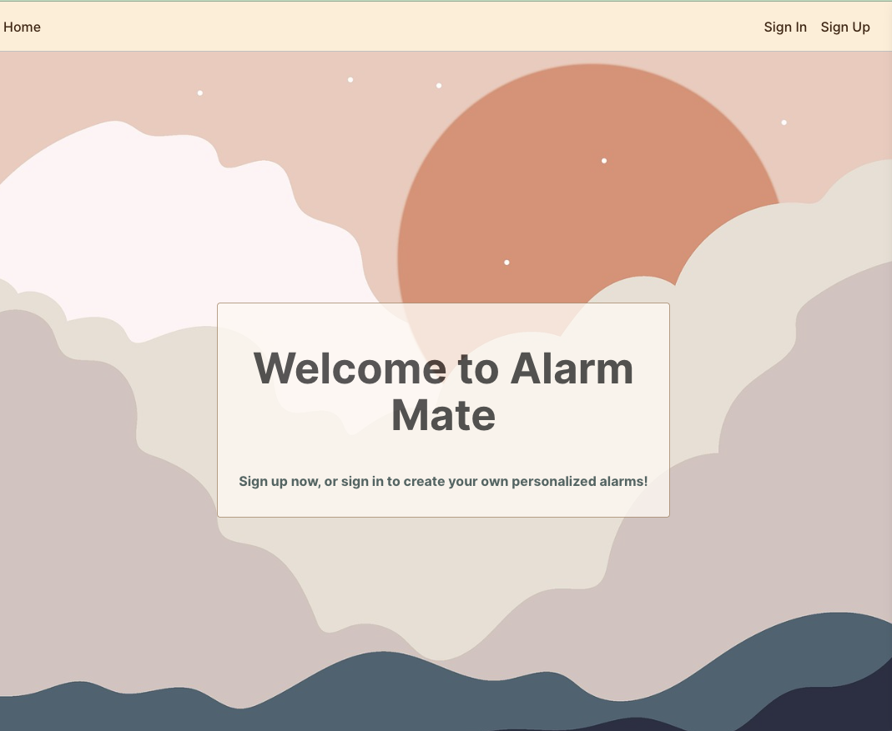
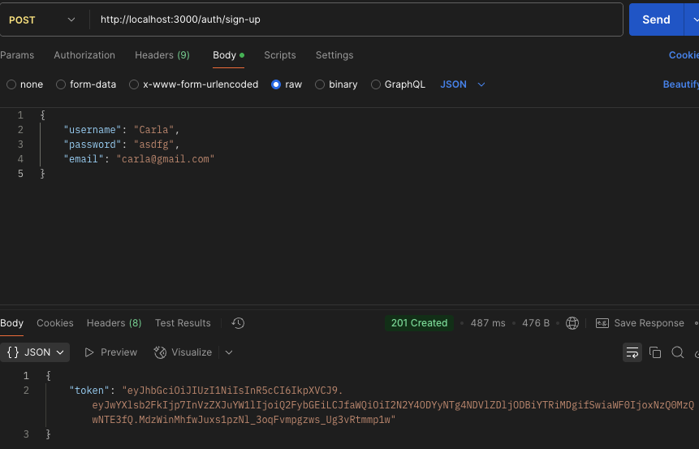
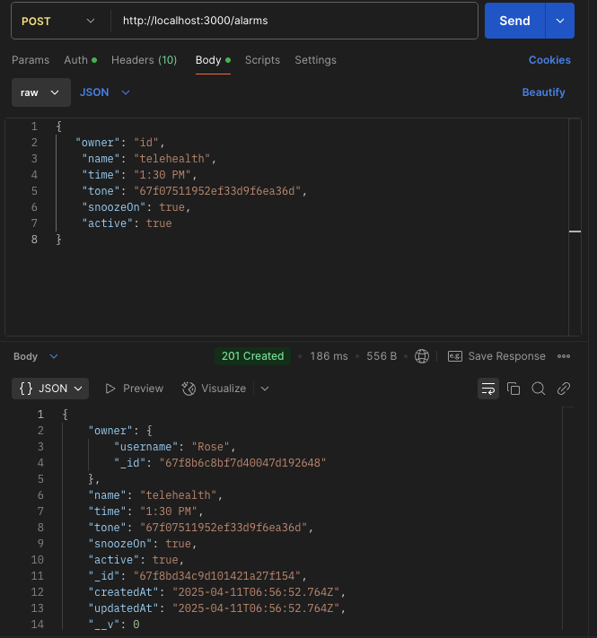
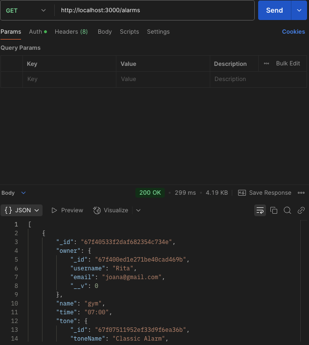
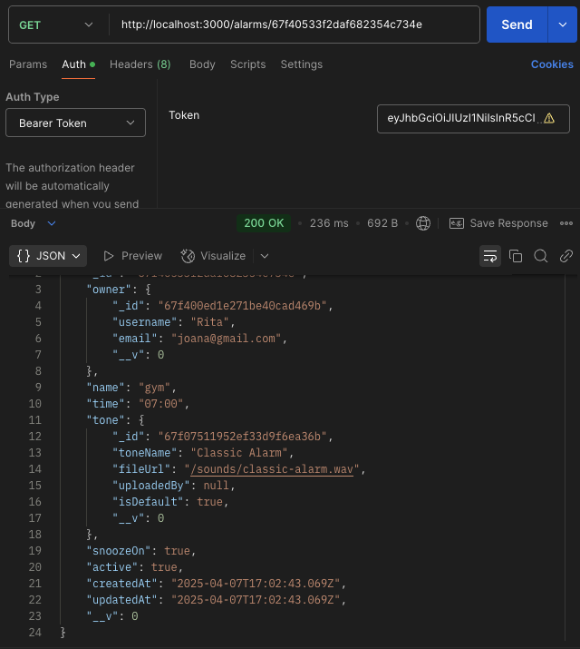
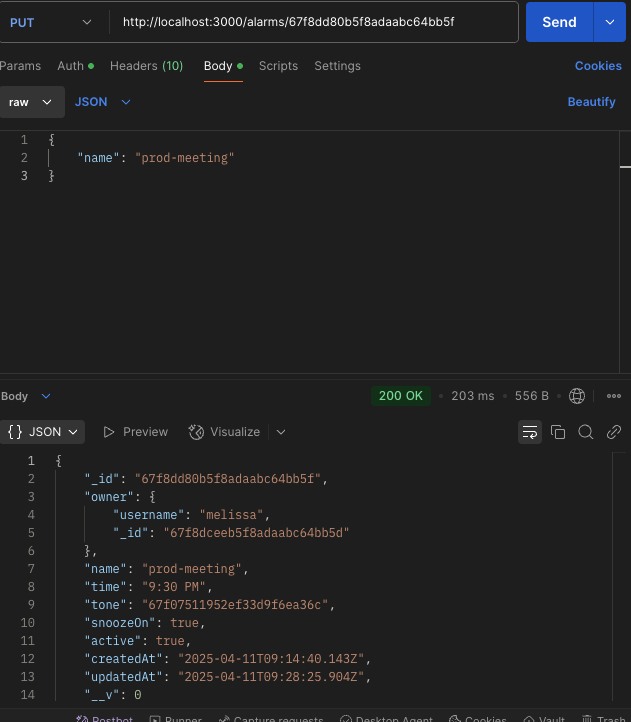
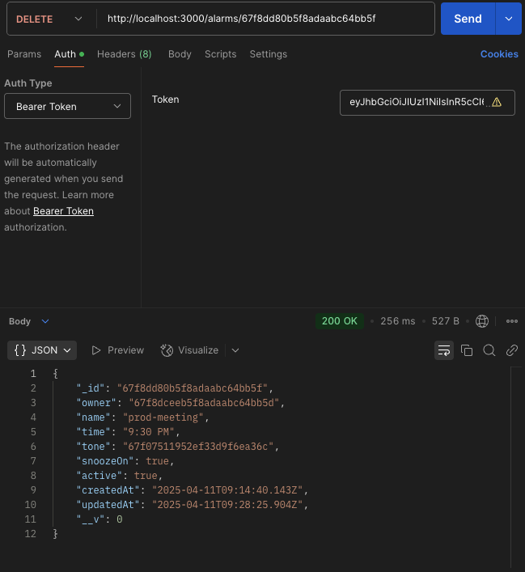

# ⏰ Alarm App - Backend

It was created to support productivity and wellness. Alarms and reminders are a big part of that, so we built a system that not only lets users set alarms but also ensures data privacy and user control through secure authentication.

## Features
* User authentication via JWT.
* CRUD operations for alarms.
* Owner-based access control.
* Mongoose models and MongoDB database.
* Middleware for protected routes.

## Technologies Used

* Node.js
* Express
* MongoDB, Mongoose
* Json Web Tokens (JWT)
* Postman
* dotenv
* Morgan
* CORS

## Project planning:
[Project planning link](https://trello.com/b/A0aIpfsD/alarm-application)

## Attributions:
* [Trello](https://trello.com)
* [mixkit.co](https://mixkit.co/free-sound-effects/alarm/)
* [flaticon](https://www.flaticon.com/free-icons/clock)
* [MongoDB](https://www.mongodb.com/)
* [Postman](https://web.postman.com/)

## Using Postman for testing Authentication

## Future Improvements

 * Sleep Tracking Integration – Track sleep cycles via phone sensors or wearables.
 * Custom Alarm Tones – Upload or record personal audio for alarms.
 * Progressive Volume Increase – Gradual volume rise to wake users gently.
 * Shake to Snooze / Dismiss – Add motion-based snooze/dismiss controls.
 * Recurring Alarms with Flex Rules – e.g., Every other Monday, or skip holidays.
 * Voice Commands – Set or stop alarms with voice (integrate with Google Assistant/Siri).
 * Cloud Sync & Backup – Sync alarms and settings across devices.

 ## Links

 [GitHub Alarm-app-backend](https://github.com/abl00mfield/alarm-app-back-end)
 
 [deployed backend](https://alarmmate-e356a4b14b23.herokuapp.com/)